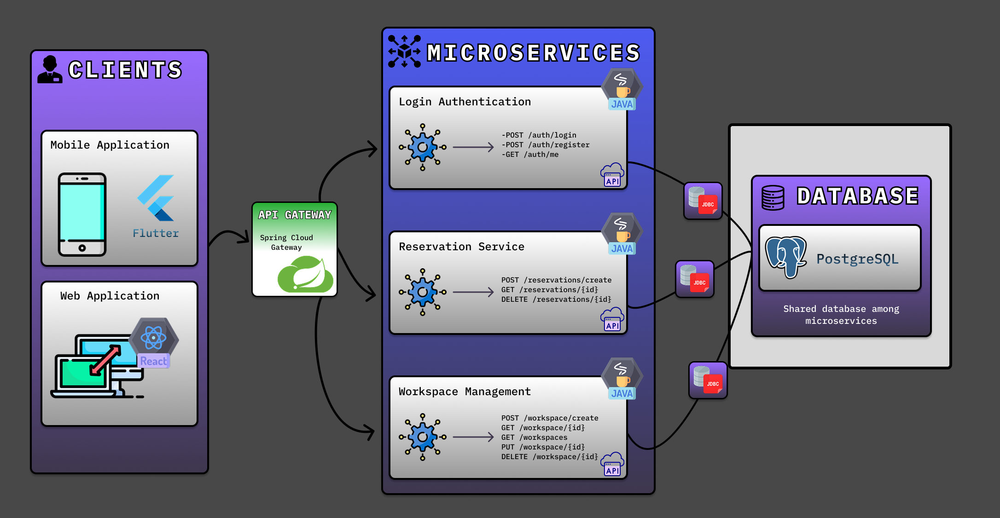
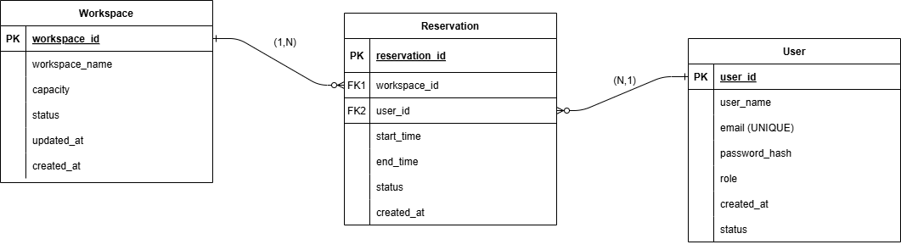

## Sobre o Projeto

O projeto é um Sistema de Gestão para Coworking, focado na reserva de salas presenciais em Belo Horizonte - MG. Ele permite que usuários realizem e gerenciem reservas de espaços de trabalho, garantindo eficiência e praticidade na administração do coworking. 

## APIs e Web Services
A aplicação expõe uma API RESTful segura, baseada em Spring Boot e Spring Security, para facilitar a integração com diferentes clientes (web, mobile).

- APIs: Disponibilizam endpoints para autenticação, gerenciamento de usuários, reservas de salas e espaços de trabalho.
- Web Services: Utilizam JSON como formato de troca de dados, seguindo padrões REST e boas práticas de segurança (JWT para autenticação).

Esse modelo garante escalabilidade, interoperabilidade e segurança para o sistema. 

## Objetivos da API

### Disponibilizar um serviço centralizado para a gestão de reservas de salas  

- Permitir que os usuários consultem a disponibilidade das salas em tempo real.  
- Permitir a realização, alteração e cancelamento de reservas de forma eficiente, evitando conflitos de agendamento por meio de regras de negócio definidas.  

### Garantir segurança e controle de acesso  

- Implementar autenticação de usuários (ex.: login com e-mail e senha) e suporte a múltiplos níveis de acesso (usuários comuns e administradores).  
- Armazenar credenciais de forma segura utilizando hash e criptografia para proteger dados sensíveis.  

### Fornecer integração e escalabilidade  

- Disponibilizar endpoints bem documentados para possível integração com outros sistemas (ex.: sistemas de pagamento, notificações externas, etc.).  
- Garantir escalabilidade com uma estrutura que permita fácil expansão no futuro.  

### Oferecer uma experiência fluida e responsiva  

- Otimizar tempos de resposta processando requisições de forma eficiente.  
- Retornar dados em formato JSON para facilitar a integração com aplicações web e mobile.  

### Facilitar a administração do coworking  

- Permitir que administradores cadastrem, editem e removam salas disponíveis no sistema.  
- Disponibilizar geração de relatórios simples sobre ocupação e uso dos espaços, permitindo análise de dados para otimizar a gestão do coworking.  

## Modelagem da Aplicação





## Tecnologias Utilizadas

### Backend & API
 Java (Spring Boot) – Framework robusto para criação de APIs RESTful com segurança e escalabilidade.
 Spring Security – Implementação de autenticação e autorização, utilizando JWT para controle de acesso.

### Banco de Dados

### Autenticação & Segurança
 JWT (JSON Web Token) – Gerenciamento seguro de autenticação e autorização.
 BCrypt – Hash de senhas para garantir proteção contra ataques.

### Comunicação & Integração
 JSON – Formato padrão de troca de dados entre cliente e servidor.
 OpenAPI (Swagger) – Documentação interativa da API para facilitar testes e integração.
 RESTful APIs – Padrão de arquitetura para garantir interoperabilidade.

### Ferramentas de Desenvolvimento & Deploy
 Docker – Contêinerização para garantir ambientes consistentes.
 Git & GitHub – Controle de versão do código-fonte.
 Postman – Testes e validação de requisições da API.

## API Endpoints

Abaixo está uma lista dos principais endpoints da API do sistema de agendamento de salas, com as operações disponíveis, parâmetros esperados e respostas retornadas. A documentação está estruturada para ser clara e concisa, seguindo o exemplo do serviço de autenticação e reserva.

## Login Authentication
### Endpoint:  ```POST /auth/login```
- Método: POST
- URL: /auth/login
- Parâmetros da Request:
- ```user_name```: Nome do usuário (string, obrigatório)
- ```email```: Email do usuário (string, obrigatório)
- ```password_hash```: Senha do usuário (hash, obrigatório)
  
  - Resposta:
    
- Sucesso (200 OK)
```
{
  "message": "Login Successful",
  "data": {
    "token": "eyJhbGciOiJIUzI1NiIsInR5cCI6IkpXVCJ9...",
    "expiresIn": 3600
  }
}
```
- Erro (401 Unathorized)
```
{
  "message": "Error",
  "error": {
    "message": "Invalid credentials",
    "details": "The email or password provided is incorrect."
  }
}
```
### Endpoint:  ```POST /auth/register```
- Método: POST
- URL: /auth/register
- Parâmetros da Request:
  - ```user_name```: Nome completo do usuário (string, opcional)
  - ```email```: Endereço de e-mail do usuário (string, obrigatório)
  - ```password_hash```: Senha do usuário (hash, obrigatório)
  - ```role```: Tipo de usuário (string, opcional, valores: "admin", "customer", etc.)
 
  - Resposta:

- Sucesso (201 Created)
```
{
  "message": "User registered successfully",
  "data": {
    "id": "550e8400-e29b-41d4-a716-446655440000",
    "user_name": "John Doe",
    "email": "johndoe@example.com",
    "role": "customer",
    "created_at": "2025-03-23T10:15:30Z"
  }
}
```
- Erro (400 Bad Request)
```
{
  "message": "Error",
  "error": {
    "message": "Email already exists",
    "details": "The provided email is already in use."
  }
}
```

### Endpoint:  ```GET /auth/me```
- Método: GET
- URL: /auth/me
- Headers:
- ```Authorization```: Bearer token (string, obrigatório)

- Observação:  Nenhum outro parâmetro é necessário na request, pois o usuário será idenficado pelo token JWT.

  - Resposta:
    
- Sucesso (200 OK)

```
{
  "message": "User Profile Retrieved",
  "data": {
    "id": "550e8400-e29b-41d4-a716-446655440000",
    "user_name": "John Doe",
    "email": "johndoe@example.com",
    "role": "customer",
    "created_at": "2025-03-23T12:00:00Z"
  }
}
```
- Erro (401 Unauthorized)    
```
{
  "message": "Error",
  "error": {
    "message": "Invalid token",
    "details": "Token is missing or invalid."
  }
}
```

## Reservation Service
### Endpoint:  ```POST /reservations/create```
- Método: POST
- URL: /reservations/create
- Parâmetros da Request:
- ```workspace_id```: UUID do espaço reservado (string, obrigatório)
- ```user_id```: UUID do usuário (string, obrigatório)
- ```start_time```: Horário de início da reserva (timestamp, obrigatório)
- ```end_time```: Horário de término da reserva (timestamp, obrigatório)
- ```status```: Status da reserva (string, opcional, valores: "confirmed", "canceled")
  
  - Resposta:

- Sucesso (201 Created)
```
{
  "message": "Reservation created successfully",
  "data": {
    "id": "123e4567-e89b-12d3-a456-426614174000",
    "workspace_id": "550e8400-e29b-41d4-a716-446655440000",
    "user_id": "660e8400-e29b-41d4-a716-446655440000",
    "start_time": "2025-03-24T10:00:00Z",
    "end_time": "2025-03-24T12:00:00Z",
    "status": "confirmed",
    "created_at": "2025-03-23T12:00:00Z"
  }
}
```
- Erro (400 Bad Request)    
```
{
  "message": "Error",
  "error": {
    "code": 400,
    "message": "Time slot unavailable",
    "details": "The selected time slot is already booked."
  }
}
```
- Erro (404 Not Found)
```
{
  "message": "Error",
  "error": {
    "code": 404,
    "message": "Workspace not found",
    "details": "The specified workspace does not exist."
  }
}
```
- Erro (403 Forbidden)   
```
{
  "message": "Error",
  "error": {
    "code": 403,
    "message": "Unauthorized user",
    "details": "User does not have permission to create a reservation."
  }
}
```

### Endpoint:  ```GET /reservations/{id}```

- Método: GET
- URL: /reservations/{id}
- Parâmetros da Request: Query Params.
  
  - Resposta:

- Sucesso (200 ok)
```
{
  "message": "Reservation retrieved successfully",
  "data": {
    "id": "123e4567-e89b-12d3-a456-426614174000",
    "workspace_id": "550e8400-e29b-41d4-a716-446655440000",
    "user_id": "660e8400-e29b-41d4-a716-446655440000",
    "start_time": "2025-03-24T10:00:00Z",
    "end_time": "2025-03-24T12:00:00Z",
    "status": "confirmed",
    "created_at": "2025-03-23T12:00:00Z"
  }
}
```
- Erro (404 Not Found)
```
{
  "message": "Error",
  "error": {
    "code": 404,
    "message": "Reservation not found",
    "details": "The specified reservation does not exist."
  }
}
```

### Endpoint:  ```DELETE /reservations/{id}```

- Método: DELETE
- URL: /reservations/{id}
- Parâmetros da Request: Query Params.
  
  - Resposta:

- Sucesso (200 ok)
```
{
  "message": "Reservation deleted successfully"
}
```
- Erro (404 Not Found)
```
{
  "message": "Error",
  "error": {
    "code": 404,
    "message": "Reservation not found",
    "details": "The specified reservation does not exist."
  }
}
```
## Workspace Management
### Endpoint:  ```POST /workspace/create```

- Método: POST
- URL: /workspace/create
- Headers: Authorization: Bearer {jwt_token}
- Parâmetros da Request:
- ```workspace_name```: Nome do espaço (string, obrigatório)
- ```capacity```: Capacidade máxima (int, obrigatório)
- ```location```: Localização do espaço (string, obrigatório)
  
  - Resposta:

- Sucesso (201 Created)
```
{
  "message": "Workspace created successfully",
  "data": {
    "id": "550e8400-e29b-41d4-a716-446655440000",
    "workspace_name": "Sala de Reunião 1",
    "capacity": 10,
    "location": "Andar 3, Sala 305",
    "created_at": "2025-03-23T12:00:00Z"
  }
}
```
- Erro (400 Bad Request)
```
{
  "message": "Error",
  "error": {
    "code": 400,
    "message": "Invalid data",
    "details": "Workspace name, location and capacity are required."
  }
}
```
- Erro (404 Not Found)
```
{
  "message": "Error",
  "error": {
    "code": 404,
    "message": "Reservation not found",
    "details": "The specified reservation does not exist."
  }
}
```
### Endpoint:  ```GET /workspaces```

- Método: GET
- URL: /workspaces
- Headers: Authorization: Bearer Token
- Parâmetros da Request: Nenhum
  
  - Resposta:
   
- Sucesso (200 Created)
```
{
  "message": "Workspaces retrieved successfully",
  "data": [
    {
      "id": "550e8400-e29b-41d4-a716-446655440000",
      "workspace_name": "Sala de Reunião A",
      "capacity": 10,
      "location": "Andar 1 - Prédio Principal",
      "created_at": "2025-03-23T12:00:00Z",
      "updated_at": "2025-03-25T09:30:00Z"
    },
    {
      "id": "660e8400-e29b-41d4-a716-446655440000",
      "workspace_name": "Sala de Conferência B",
      "capacity": 25,
      "location": "Andar 2 - Prédio Anexo",
      "created_at": "2025-03-22T15:45:00Z",
      "updated_at": "2025-03-26T08:15:00Z"
    }
  ]
}
```
 - Erro (401 Unauthorized - Token inválido ou ausente)
```
{
  "message": "Unauthorized",
  "error": {
    "code": 401,
    "message": "Invalid or missing authentication token."
  }
}
```

### Endpoint:  ```GET /workspace/{id}```

- Método: GET
- URL: /workspace/{id}
- Headers: Authorization: Bearer {jwt_token}
- Parâmetros da Request: Query Params.
  
  - Resposta:
   
- Sucesso (200 Created)
```
{
  "message": "Workspace retrieved successfully",
  "data": {
    "id": "550e8400-e29b-41d4-a716-446655440000",
    "workspace_name": "Sala de Reunião 1",
    "capacity": 10,
    "location": "Andar 3, Sala 305",
    "created_at": "2025-03-23T12:00:00Z"
  }
}
```
 - Erro (404 Not Found)
```
{
  "message": "Error",
  "error": {
    "code": 404,
    "message": "Workspace not found",
    "details": "The specified workspace does not exist."
  }
}
```

### Endpoint:  ```PUT /workspace/{id}```

- Método: PUT
- URL: /workspace/{id}
- Headers: Authorization: Bearer {jwt_token}
- Parâmetros da Request:
- ```workspace_name```: Nome do espaço (string, opcional)
- ```capacity```: Capacidade máxima (int, opcional)
- ```location```: Localização do espaço (string, opcional)
  
  - Resposta:

- Sucesso (200 Created)
```
{
  "message": "Workspace updated successfully"
}
```
- Erro (400 Bad Request)
```
{
  "message": "Error",
  "error": {
    "code": 400,
    "message": "Invalid data",
    "details": "At least one field (workspace_name, capacity, or location) must be provided."
  }
}
```
- Erro (404 Not Found)
```
json

{
  "message": "Error",
  "error": {
    "code": 404,
    "message": "Workspace not found",
    "details": "The specified workspace does not exist."
  }
}
```

### Endpoint:  ```DELETE /workspace/{id}```

- Método: DELETE
- URL: /workspace/{id}
- Headers: Authorization: Bearer {jwt_token}
- Parâmetros da Request: Query Params.
  
  - Resposta:

- Sucesso (200 Created)
```
{
  "message": "Workspace deleted successfully"
}
```
- Erro (404 Not Found)
```
{
  "message": "Error",
  "error": {
    "code": 404,
    "message": "Workspace not found",
    "details": "The specified workspace does not exist."
  }
}
```
## Considerações de Segurança

A segurança da aplicação é essencial para proteger dados sensíveis dos usuários e garantir que apenas usuários autorizados possam acessar e manipular informações. A seguir, estão as principais práticas adotadas para garantir a segurança da API distribuída.

### Autenticação e Autorização
#### Autenticação com JWT (JSON Web Token)

A autenticação é baseada em JWT, utilizando a secret key gerada aleatoriamente:
```3cfa76ef14937c1c0eA519f8fC017a50fcd04a2420f8e8bcd0a7567c272e007b```

O token é gerado no login e deve ser enviado no header Authorization para autenticar as requisições:

```Authorization: Bearer <token>```

Cada token possui um tempo de expiração (expiresIn) para evitar reutilização indevida.

#### Autorização baseada em roles (Spring Security)

O sistema diferencia perfis de usuário (customer, admin) e restringe o acesso a determinadas rotas.

Exemplo:

- Apenas administradores podem gerenciar usuários e espaços.
- Usuários normais podem criar, visualizar e cancelar suas próprias reservas.

#### Proteção contra ataques de força bruta

-Implementação de limitação de tentativas de login para evitar ataques de força bruta.
-Exemplo: Bloqueio temporário após X tentativas falhas.

### Proteção de Dados Sensíveis
#### Criptografia de Senhas com BCrypt

- As senhas não são armazenadas em texto puro, mas sim criptografadas com BCrypt.
- O BCrypt gera um hash único para cada senha, impossibilitando a descriptografia direta.]

#### Proteção de Tokens JWT
- Os tokens não devem ser armazenados no localStorage no front-end (risco de XSS).
- Devem ser armazenados de forma segura.

#### Uso de HTTPS

- Todas as comunicações são feitas via HTTPS, garantindo a criptografia dos dados durante a transmissão.

A segurança foi integrada desde o início do desenvolvimento, garantindo proteção contra ataques, autenticação segura, e armazenamento seguro de credenciais. Todas as práticas adotadas ajudam a manter a integridade e confidencialidade dos dados no sistema.

## Implantação

[Instruções para implantar a aplicação distribuída em um ambiente de produção.]

1. Defina os requisitos de hardware e software necessários para implantar a aplicação em um ambiente de produção.
2. Escolha uma plataforma de hospedagem adequada, como um provedor de nuvem ou um servidor dedicado.
3. Configure o ambiente de implantação, incluindo a instalação de dependências e configuração de variáveis de ambiente.
4. Faça o deploy da aplicação no ambiente escolhido, seguindo as instruções específicas da plataforma de hospedagem.
5. Realize testes para garantir que a aplicação esteja funcionando corretamente no ambiente de produção.

## Testes

[Backend Testes](docs/backend-tests.md) <br> 

# Referências

-Microfundamento: APIs e Web Services
-Microfundamento: Arquitetura de Software Distribuído
-SpringBoot Docs
-Stackoverflow
