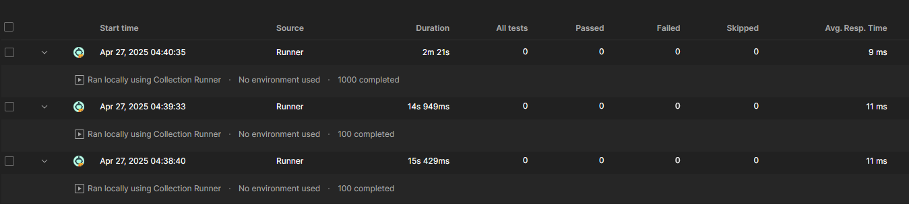

# Testes e Validação de Funcionalidades - Backend

---

## 1. Objetivo dos Testes
Validar o correto funcionamento dos serviços disponibilizados pela API, garantindo que os endpoints atendam aos requisitos funcionais, tratem erros adequadamente e suportem múltiplas requisições simultâneas.

---

## 2. Estratégia de Testes
Foram realizados dois tipos de testes distintos:

| Tipo de Teste               | Objetivo |
|------------------------------|----------|
| Testes Funcionais            | Verificar o funcionamento correto de cada endpoint, respostas esperadas e tratamentos de erro. |
| Testes de Carga              | Avaliar o comportamento do sistema sob múltiplas requisições simultâneas. |

> **Ferramentas Utilizadas:**  
> - **Swagger UI** para testes funcionais e de validação de dados.  
> - **Postman (Runner)** para testes de carga.

---

## 3. Cenários de Testes Funcionais

### 3.1. Serviços de Autenticação

| Cenário                           | Requisição                   | Resultado Esperado         |
|------------------------------------|-------------------------------|-----------------------------|
| Login com credenciais válidas      | `POST /auth/login`            | 200 OK com token JWT        |
| Login com credenciais inválidas    | `POST /auth/login`            | 500 Bad Credentials         |
| Registro com dados válidos         | `POST /auth/register`         | 201 Created                 |
| Registro com e-mail já utilizado   | `POST /auth/register`         | 400 Bad Request             |

#### Evidências:
- **Login com credenciais válidas** (`POST /auth/login`)

- **Login com credenciais inválidas** (`POST /auth/login`)

---

### 3.2. Serviços de Gestão de Workspaces

| Cenário                                | Requisição                   | Resultado Esperado         |
|----------------------------------------|-------------------------------|-----------------------------|
| Criação de novo espaço válido           | `POST /workspace/create`      | 201 Created                 |
| Consulta de espaço por ID existente     | `GET /workspace/{id}`         | 200 OK                      |
| Atualização de espaço existente         | `PUT /workspace/{id}`         | 200 OK                      |
| Exclusão de espaço existente            | `DELETE /workspace/{id}`      | 200 OK                      |

#### Evidências:
- **Criação de novo espaço válido** (`POST /workspace/create`)

- **Consulta de espaço por ID existente** (`GET /workspace/{id}`)

- **Atualização de espaço existente** (`PUT /workspace/{id}`)

---

### 3.3. Serviços de Gestão de Reservas

| Cenário                                  | Requisição                    | Resultado Esperado         |
|------------------------------------------|--------------------------------|-----------------------------|
| Criação de reserva válida                | `POST /reservations/create`    | 201 Created                 |
| Criação de reserva com workspace inválida| `POST /reservations/create`    | 500 Workspace not Found     |
| Consulta de reserva existente            | `GET /reservations/{id}`       | 200 OK                      |
| Exclusão de reserva inexistente          | `DELETE /reservations/{id}`    | 404 Not Found               |

#### Evidências:
- **Criação de reserva válida** (`POST /reservations/create`)

- **Criação de reserva com workspace inválida** (`POST /reservations/create`)

- **Consulta de reserva por ID existente** (`GET /reservations/{id}`)

- **Exclusão de reserva inexistente** (`DELETE /reservations/{id}`)

---

## 4. Validação de Dados (Campos Obrigatórios)

| Campo               | Teste Realizado                            | Resultado Esperado     |
|---------------------|--------------------------------------------|-------------------------|
| `workspace_name`    | Envio de campo vazio                       | 400 Bad Request         |
| `capacity`          | Envio de valor não numérico                | 400 Bad Request         |
| `location`          | Envio de campo vazio (permitido)           | 200 OK                  |
| `start_time/end_time`| Envio de datas em formato inválido        | 400 Bad Request         |
| `status`            | Envio de valor inválido                    | 400 Bad Request         |

#### Evidências:
- **Validação de Dados (Campos Obrigatórios)**

---

## 5. Teste de Carga

**Objetivo:** Avaliar a capacidade da aplicação em responder corretamente a múltiplas requisições simultâneas.

**Cenário Simulado:**
- 100 requisições simultâneas ao endpoint `GET /workspaces`.

| Métrica               | Resultado Obtido    | Limite Aceitável    | Status |
|------------------------|----------------------|---------------------|--------|
| Latência Média         | 11 ms                | < 30 ms            | Sucesso |
| Taxa de Erros          | 0%                    | 0%                  | Sucesso |

- 1000 requisições simultâneas aos endpoint `GET /workspaces` e `GET /reservations`.

| Métrica               | Resultado Obtido    | Limite Aceitável    | Status |
|------------------------|----------------------|---------------------|--------|
| Latência Média         | 9 ms                  | < 30 ms            | Sucesso |
| Taxa de Erros          | 0%                    | 0%                  | Sucesso |

> **Ferramenta Utilizada:** Postman Collection Runner
> 
#### Evidências:
- **Validação de Dados (Campos Obrigatórios)**

---

## 6. Ferramentas Utilizadas

| Finalidade                  | Ferramenta               |
|------------------------------|---------------------------|
| Testes Funcionais            | Swagger UI                |
| Testes de Carga              | Postman (Runner)           |

---

## 7. Considerações Finais
Todos os testes funcionais realizados apresentaram os comportamentos esperados para cenários positivos e negativos.  
O teste de carga realizado demonstrou que o sistema é capaz de lidar com múltiplas requisições simultâneas sem degradação significativa de desempenho.

A aplicação encontra-se validada conforme os objetivos propostos para esta etapa.

