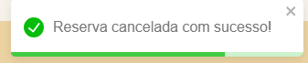

# Testes e Validação de Funcionalidades - Frontend Mobile

---

## 1. Objetivo dos Testes

Garantir que o aplicativo mobile do Belo Space atenda aos requisitos funcionais e não funcionais definidos, validando a experiência do usuário, a integração com o backend e a consistência dos dados exibidos na interface.

---

## 2. Estratégia de Testes

Os testes do app foram realizados manualmente, simulando o comportamento real do usuário. Foram validados aspectos de navegação, validação de campos, integração com API (Swagger) e persistência no banco de dados.

| Tipo de Teste             | Objetivo                                                                 |
|---------------------------|--------------------------------------------------------------------------|
| Testes Funcionais         | Validar se os componentes e funcionalidades funcionam conforme esperado |
| Testes de Integração      | Verificar se as interações entre frontend e backend estão corretas       |
| Testes de Navegação       | Confirmar que os fluxos de tela estão acessíveis e coerentes             |
| Testes de Validação       | Conferir tratamento de campos obrigatórios e mensagens de erro           |

---

## 3. Cenários de Testes Funcionais

### 3.1. Registrar e realizar Login com Usuário válido

| Item                       | Descrição                                      |
|----------------------------|-----------------------------------------------|
| Tela                      | Login                                          |
| Funcionalidade Testada    | Registro e autenticação de usuário com dados válidos |
| Requisito Relacionado     | [RF01] Permitir que o usuário se registre e faça login no App |
| Resultado Esperado        | pop-up de sucesso e redirecionamento para a tela principal |
| Resultado Obtido          | Sucesso                                        |
| Observações               | Token JWT gerado e armazenado no navegador     |

#### Evidências

- **1. Cadastro de usuário:**

  
  
- **2. Login do usuário:**

  

- **3. pop-up Login bem sucedido:**

  

- **4. Evidência Swagger Backend:**

  
  
- **5. Evidência Banco de Dados:**

  

---

### 3.2. Reservar sala e gerenciar reservas

| Item                       | Descrição                                      |
|----------------------------|-----------------------------------------------|
| Tela                      | Agendar reserva e gerenciamento de reservas    |
| Funcionalidade Testada    | Realizar o agendamento e gerenciar as reservas |
| Requisito Relacionado     | [RF02] Permitir que o usuário consiga agendar e gerenciar suas reservas |
| Resultado Esperado        | pop-up de sucesso e redirecionamento           |
| Resultado Obtido          | Sucesso                                        |

#### Evidências

- **1. Reservar:**

  
  
- **2. Gerenciar reserva:**

  
  

- **3. pop-up reserva bem sucedida:**

  

- **4. Evidência Swagger Backend:**

  
  
- **5. Evidência Banco de Dados:**

  

---

### 3.3. Reagendamento de reserva

| Item                       | Descrição                                      |
|----------------------------|-----------------------------------------------|
| Tela                      | Gerenciamento de reservas                      |
| Funcionalidade Testada    | Realizar o reagendamento da reserva           |
| Requisito Relacionado     | [RF03] Permitir que o usuário edite ou cancele suas reservas antes do horário agendado |
| Resultado Esperado        | pop-up de sucesso e redirecionamento para a tela de gerenciamento reservas |
| Resultado Obtido          | Sucesso                                        |

#### Evidências

- **1. Reagendar:**

  

- **2. Reagendado:**

  

- **3. pop-up reagendamento bem sucedido:**

  

- **4. Evidência Swagger Backend:**

  
  
- **5. Evidência Banco de Dados:**

  

---
### 3.4. Cancelamento de reserva

| Item                       | Descrição                                      |
|----------------------------|-----------------------------------------------|
| Tela                      | Gerenciamento de reservas                      |
| Funcionalidade Testada    | Realizar o cancelamento da reserva           |
| Requisito Relacionado     | [RF03] Permitir que o usuário edite ou cancele suas reservas antes do horário agendado |
| Resultado Esperado        | pop-up de sucesso e redirecionamento para a tela de reserva vazia |
| Resultado Obtido          | Sucesso                                        |

#### Evidências

- **1. Cancelar:**

  

- **2. pop-up cancelamento bem sucedido:**

  

- **3. Evidência Swagger Backend:**

  
  
- **4. Evidência Banco de Dados:**

  

---

## 4. Cenários de Testes de Erros Esperados

| Cenário                                | Resultado Esperado                  |
|----------------------------------------|-------------------------------------|
| Login com email incorreto              | Inserir email valido                |
| Login com Senha incorreta              | Senha Invalida                      |
| Não preenchimentodo campo no login     | Email e senha obrigatórios          |
| Não preenchimentodo campo no cadastro  | Email e senha obrigatórios          |
| Prenchimento errado da area de email   | Erro de credencial                  |
| Senha não coincidentes no cadatro      | Senhas não coincidem                |
| Cadastro errado do email               | Insira um email Valido              |
| Cadastro errado da Senha               | Senha deve ter 6 caracteres         |
| Criação de credenciais existentes      | Erro 500: Email ou senha incorretos |

#### Evidências

- **1. Login com email incorreto:**

- **2. Login com Senha incorreta:**

- **3. Não preenchimentodo campo no login:**

- **4. Não preenchimentodo campo no cadastro:**

- **5. Prenchimento errado da area de email:**

- **6. Senha não coincidentes no cadatro:**

- **7. Cadastro errado do email e senha:**

- **8. Criação de credenciais existentes:**

---

## 5. Considerações Finais

Todos os testes manuais realizados obtiveram resultados satisfatórios.  
A integração entre frontend, backend e banco de dados foi evidenciada.  
Os fluxos principais (login, reserva, gerenciamento) apresentaram comportamento estável e coerente com os requisitos do projeto.
