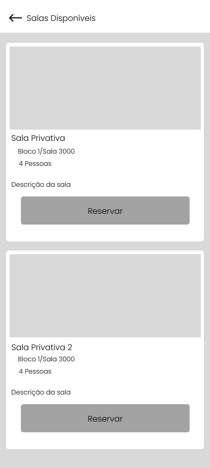

# Front-end Móvel

O front end para o app mobile desta aplicação tem como objetivo proporcionar uma interface moderna, intuitiva e responsiva para os usuários do sistema de gestão de coworking. A aplicação permite que usuários consultem espaços disponíveis, realizem reservas e gerenciem suas atividades de forma prática e segura.

---

## Projeto da Interface

O projeto será dividido em 4 interfaces web:
- **Login e Register:** interface de login dos usuários, com possibilidade de cadastro no sistema.
- **Workspaces:** permitir que os usuários autenticados possam reservar os espaços, podendo escolher as salas e os dias disponíveis para agendamento.
- **Gerenciamento de Reservas:** permitir que os usuários autenticados possam visualizar, reagendar ou cancelar suas reservas existentes.
- **Sobre e Perfil**: interfaces auxiliares que contém as informações sobre as versões e os direitos do aplicativo, e os dados do usuário autenticado.

## Estrutura da Página de Login

- **Formulário de Login:**

- **Formulário de Cadastro:**
  

## Estrutura da Página de Workspaces

- **Workspaces:**

- **Nova Reserva:**

## Estrutura da Página de Gerenciamento de Reservas

- **Reservas do Usuário:**
  

- **Detalhes da Reserva:**
  

- **Reagendar Reserva:**
  

- **Cancelar Reserva:**
  

## Estrutura da Página Sobre

- **About:**

- **Profile:**

---

### Wireframes

**Formulário de Login Wireframe:**

**Formulário de Cadastro Wireframe:**

**Workspaces Wireframe:**

**Nova Reserva Wireframe:**

**Reservas do Usuário Wireframe:**

**Detalhes da Reserva Wireframe:**

**Reagendar Reserva Wireframe:**

**Cancelar Reserva Wireframe:**

**About Wireframe:**

**Profile Wireframe:**

---

### Design Visual

O design visual segue uma linha clean e corporativa, com o objetivo de transmitir confiabilidade e modernidade.

- **Paleta de Cores:**
  - Laranja claro (#F58220) - Destaques e botões.
  - Bege (#ECD3A2) - Background geral.
  - Azul escuro (#18344D) - Background de elementos.
  - Branco (#FFFFFF) - Plano de fundo.
  - Tons de cinza para textos secundários.

- **Tipografia:**
  - Principal: "Poppins" (Google Fonts).
  - Títulos: "Poppins Bold", textos normais: "Poppins Regular".

- **Ícones:**
  - Utilização de ícones minimalistas relacionados a coworking, comunicação e serviços.

- **Estilo de Layout:**
  - Estrutura em colunas verticais, com espaçamento generoso entre os elementos.
  - Botões grandes para facilitar a interação em dispositivos móveis.
  - Ícone de perfil com menu suspenso para facilitar a navegação entre funcionalidades.

---

## Fluxo de Dados
As imagens do figma e as registradas abaixo neste documento, ilustram o fluxo completo de navegação do aplicativo Belo Space, contemplando as principais interações do usuário desde o cadastro até a gestão de reservas.

A primeira imagem representa o fluxo de acesso, com validações de cadastro e login, além do processo de recuperação de senha. Já a segunda imagem cobre a experiência após o login, incluindo agendamento de salas, visualização e cancelamento de reservas, acesso ao perfil e opção de logout.

Esses fluxos garantem uma navegação clara e intuitiva para o usuário, reforçando a usabilidade e eficiência da aplicação.

[Link de acesso ao Figma do User Flow](https://www.figma.com/board/C8eRwkC8NGeR635mpIEnlH/User-Flow-Diagram-for-FigJam--Community-?node-id=0-1&p=f&t=NrvBACWEv0aZdlvV-0)  

- Macro imagem: 

- Parte 1:

- Parte 2:

---

## Tecnologias Utilizadas

- **Linguagem Principal:** Dart (3.8.1)
- **Framework:** Flutter (3.32.4)
- **Design:** Figma
  
## Considerações de Segurança
A segurança da aplicação front-end visa proteger os dados do usuário, garantir a integridade da autenticação e evitar vulnerabilidades comuns em aplicações web.

---

### Autenticação com JWT
A autenticação é realizada por meio de tokens JWT gerados pelo backend no login. O token é armazenado em memória (evitando localStorage) e enviado nas requisições via header:
`Authorization: Bearer <token>`

O token possui tempo de expiração e é utilizado para acesso a rotas protegidas da aplicação.

### Controle de Acesso
A interface controla a visibilidade de elementos com base no perfil do usuário autenticado (admin ou customer). Rotas sensíveis redirecionam para login caso não haja autenticação válida.

### Validação de Dados
Formulários realizam validação local dos campos obrigatórios, formatos e regras de negócio, reduzindo falhas de envio e protegendo a aplicação contra dados inconsistentes.

### Prevenção de Vulnerabilidades
A aplicação evita inserção direta de conteúdo HTML no DOM e não utiliza `dangerouslySetInnerHTML`, prevenindo XSS. A autenticação via token mitiga riscos de CSRF.

### Comunicação Segura
Todas as requisições são feitas sobre HTTPS, assegurando criptografia dos dados trocados entre o front-end e a API.

---

## Testes

[Frontend Mobile Testes](frontent-mobile-tests)   

# Referências

- Microfundamento: APIs e Web Services
- Microfundamento: Arquitetura de Software Distribuído
- Microfundamento: Desenvolvimento de Aplicações Móveis
- Flutter Docs
- Dart Docs
