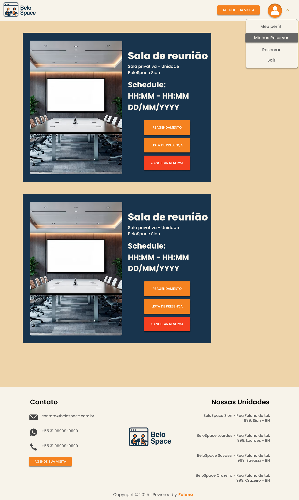
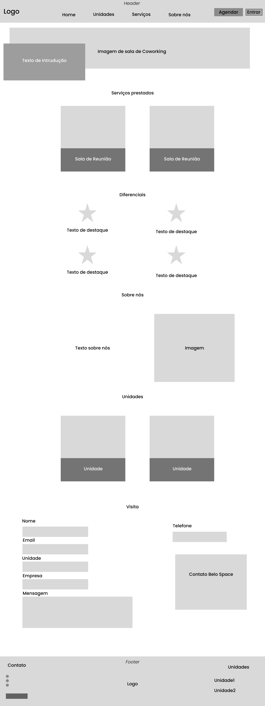

# Front-end Web

O front-end web desta aplicação tem como objetivo proporcionar uma interface moderna, intuitiva e responsiva para os usuários do sistema de gestão de coworking. A aplicação permite que usuários consultem espaços disponíveis, realizem reservas e gerenciem suas atividades de forma prática e segura.

---

## Projeto da Interface Web

O projeto da interface web foi desenvolvido priorizando a simplicidade, a clareza das informações e a responsividade para dispositivos móveis.  

## Estrutura da Página Principal (Homepage)

- **Header:**  
  Contém o logotipo, o menu de navegação com acesso às seções "Home", "Unidades", "Serviços", "Sobre nós", além dos botões de ação "Agende sua Visita" e "Entrar".

- **Banner Principal:**  
  Imagem de destaque de ambiente de coworking, acompanhada de uma chamada de ação promovendo a descoberta dos novos locais.

- **Serviços Prestados:**  
  Apresentação visual dos principais serviços (Sala de Reunião, Mesa Privativa) com ícones ilustrativos e descrições breves.

- **Diferenciais:**  
  Seção destacando atributos como "Studio Lab", "Sustentabilidade", "Fibra Óptica" e "Auditório Lab", cada um com ícones e texto resumido.

- **Sobre Nós:**  
  Texto descritivo sobre a missão e a visão da empresa, acompanhado de uma imagem ilustrativa do ambiente.

- **Unidades Disponíveis:**  
  Apresentação das unidades do coworking, utilizando imagens e descrições breves em formato de carrossel.

- **Formulário de Agendamento:**  
  Formulário para que o usuário possa agendar sua visita, preenchendo nome, e-mail, unidade de interesse, empresa e mensagem.

- **Footer:**  
  Contém informações de contato, endereços das unidades e um logotipo institucional.

---

## Estrutura da tela de Gerenciamento de Reserva

- **Header:**  
  Logotipo, menu de navegação principal, botão de ação "Agende sua Visita" e um ícone de perfil de usuário, que exibe um menu suspenso com opções como "Meu Perfil", "Minhas Reservas", "Reservar" e "Sair".

- **Lista de Reservas:**
  - Cada reserva é exibida como um cartão.
  - Em cada cartão consta:
    - Imagem do espaço reservado.
    - Nome da sala de reunião.
    - Unidade de localização.
    - Horário agendado.
    - Três botões de ação:
      - **Reagendar**
      - **Lista de Presença**
      - **Cancelar Reserva**
        
- **Footer:**  
  Contém informações de contato, endereços das unidades e um logotipo institucional.

---

### Wireframes

**Homepage Wireframe:**

- **Header:** Barra superior contendo navegação e botões de acesso.
- **Banner:** Área de destaque visual com imagem e chamada de ação.
- **Seções de Conteúdo:**
  - Cartões de serviços com imagens e descrições.
  - Diferenciais com ícones e texto explicativo.
  - Texto institucional "Sobre nós" e imagem ilustrativa.
  - Listagem de unidades com imagens organizadas lado a lado.
- **Formulário de Contato:** Campos de preenchimento para o agendamento de visitas.
- **Footer:** Rodapé com contatos e informações institucionais.

---

**Manage Reservation Wireframe:**

- **Header:** Barra superior contendo navegação e botões de acesso. Com opções de login e perfil de usuário.
- **Cartões de Reserva:** Imagem da sala + informações principais (nome da sala, unidade, data e hora).
- **Botões de ação:** Para reagendamento, ver lista de presença e cancelamento.
- **Footer:** Rodapé com contatos e informações institucionais.

---

### Design Visual

O design visual segue uma linha clean e corporativa, com o objetivo de transmitir confiabilidade e modernidade.

- **Paleta de Cores:**
  - Laranja claro (#F7C59F) - Destaques e botões.
  - Bege (#ECD3A2) - Background geral.
  - Azul escuro (#1A2238) - Background de elementos.
  - Branco (#FFFFFF) - Plano de fundo.
  - Tons de cinza para textos secundários.

- **Tipografia:**
  - Principal: "Poppins" (Google Fonts).
  - Títulos: "Poppins Bold", textos normais: "Poppins Regular".

- **Ícones:**
  - Utilização de ícones minimalistas relacionados a coworking, comunicação e serviços.

- **Estilo de Layout:**
  - Estrutura em colunas verticais, com espaçamento generoso entre os elementos.
  - Botões grandes para facilitar a interação em dispositivos móveis.
  - Ícone de perfil com menu suspenso para facilitar a navegação entre funcionalidades.

---

## Fluxo de Dados

[Diagrama ou descrição do fluxo de dados na aplicação.]

---

## Tecnologias Utilizadas

- **Linguagem Principal:** JavaScript (ES6+)
- **Framework:** React.js
- **Design das telas:** Figma

---

## Considerações de Segurança

[Discuta as considerações de segurança relevantes para a aplicação distribuída, como autenticação, autorização, proteção contra ataques, etc.]

## Implantação

[Instruções para implantar a aplicação distribuída em um ambiente de produção.]

1. Defina os requisitos de hardware e software necessários para implantar a aplicação em um ambiente de produção.
2. Escolha uma plataforma de hospedagem adequada, como um provedor de nuvem ou um servidor dedicado.
3. Configure o ambiente de implantação, incluindo a instalação de dependências e configuração de variáveis de ambiente.
4. Faça o deploy da aplicação no ambiente escolhido, seguindo as instruções específicas da plataforma de hospedagem.
5. Realize testes para garantir que a aplicação esteja funcionando corretamente no ambiente de produção.

## Testes

[Descreva a estratégia de teste, incluindo os tipos de teste a serem realizados (unitários, integração, carga, etc.) e as ferramentas a serem utilizadas.]

1. Crie casos de teste para cobrir todos os requisitos funcionais e não funcionais da aplicação.
2. Implemente testes unitários para testar unidades individuais de código, como funções e classes.
3. Realize testes de integração para verificar a interação correta entre os componentes da aplicação.
4. Execute testes de carga para avaliar o desempenho da aplicação sob carga significativa.
5. Utilize ferramentas de teste adequadas, como frameworks de teste e ferramentas de automação de teste, para agilizar o processo de teste.

# Referências

Inclua todas as referências (livros, artigos, sites, etc) utilizados no desenvolvimento do trabalho.
