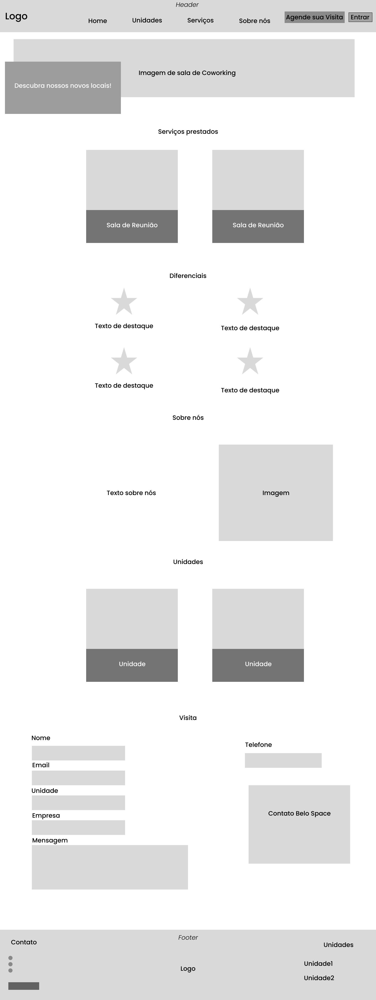

# Front-end Web

O front-end web desta aplicação tem como objetivo proporcionar uma interface moderna, intuitiva e responsiva para os usuários do sistema de gestão de coworking. A aplicação permite que usuários consultem espaços disponíveis, realizem reservas e gerenciem suas atividades de forma prática e segura.

---

## Projeto da Interface Web

O projeto da interface web foi desenvolvido priorizando a simplicidade, a clareza das informações e a responsividade para dispositivos móveis.  

- **Homepage/Landpage:**  
  Apresenta informações institucionais, principais serviços oferecidos, diferenciais do espaço, unidades disponíveis e um formulário de agendamento de visitas.

**Principais seções da Homepage:**
- **Banner inicial** com chamada de ação.
- **Serviços oferecidos** (salas de reunião, mesas privativas).
- **Diferenciais** do coworking (internet de alta velocidade, sustentabilidade, auditório).
- **Sobre nós** com a história e missão da empresa.
- **Unidades disponíveis** com carrossel de imagens.
- **Formulário de agendamento de visitas**.
- **Seção de contato** com informações completas.

---

### Wireframes

- **Topo da Página:**
  - Logotipo e menu de navegação com links para seções.
  - Botão destacado para "Agende sua Visita".

- **Banner Principal:**
  - Imagem institucional.
  - Texto de chamada ("Descubra nossos novos locais!").

- **Seções Intermediárias:**
  - Apresentação dos serviços (cartões).
  - Destaques de diferenciais (ícones e descrições).
  - Sobre nós (texto e imagem).
  - Nossas unidades (cartões).
  - Agende sua visita (formulário para o cliente).

- **Rodapé:**
  - Informações de contato e dados institucionais.
 

---

### Design Visual

O design visual segue uma linha clean e corporativa, com o objetivo de transmitir confiabilidade e modernidade.

- **Paleta de Cores:**
  - Laranja claro (#F7C59F) - Destaques e botões.
  - Azul escuro (#1A2238) - Background de elementos.
  - Branco (#FFFFFF) - Plano de fundo.
  - Tons de cinza para textos secundários.

- **Tipografia:**
  - Principal: "Poppins" (Google Fonts).
  - Títulos: "Poppins Bold", textos normais: "Poppins Regular".

- **Ícones:**
  - Utilização de ícones minimalistas relacionados a coworking, comunicação e serviços.

- **Estilo:**
  - Layout responsivo (adaptação a celulares e tablets).
  - Botões com bordas arredondadas.
  - Espaçamento adequado entre seções para melhorar a leitura.

---

## Fluxo de Dados

[Diagrama ou descrição do fluxo de dados na aplicação.]

---

## Tecnologias Utilizadas

- **Linguagem Principal:** JavaScript (ES6+)
- **Framework:** React.js
- **Design das telas:** Figma

---

## Considerações de Segurança

[Discuta as considerações de segurança relevantes para a aplicação distribuída, como autenticação, autorização, proteção contra ataques, etc.]

## Implantação

[Instruções para implantar a aplicação distribuída em um ambiente de produção.]

1. Defina os requisitos de hardware e software necessários para implantar a aplicação em um ambiente de produção.
2. Escolha uma plataforma de hospedagem adequada, como um provedor de nuvem ou um servidor dedicado.
3. Configure o ambiente de implantação, incluindo a instalação de dependências e configuração de variáveis de ambiente.
4. Faça o deploy da aplicação no ambiente escolhido, seguindo as instruções específicas da plataforma de hospedagem.
5. Realize testes para garantir que a aplicação esteja funcionando corretamente no ambiente de produção.

## Testes

[Descreva a estratégia de teste, incluindo os tipos de teste a serem realizados (unitários, integração, carga, etc.) e as ferramentas a serem utilizadas.]

1. Crie casos de teste para cobrir todos os requisitos funcionais e não funcionais da aplicação.
2. Implemente testes unitários para testar unidades individuais de código, como funções e classes.
3. Realize testes de integração para verificar a interação correta entre os componentes da aplicação.
4. Execute testes de carga para avaliar o desempenho da aplicação sob carga significativa.
5. Utilize ferramentas de teste adequadas, como frameworks de teste e ferramentas de automação de teste, para agilizar o processo de teste.

# Referências

Inclua todas as referências (livros, artigos, sites, etc) utilizados no desenvolvimento do trabalho.
