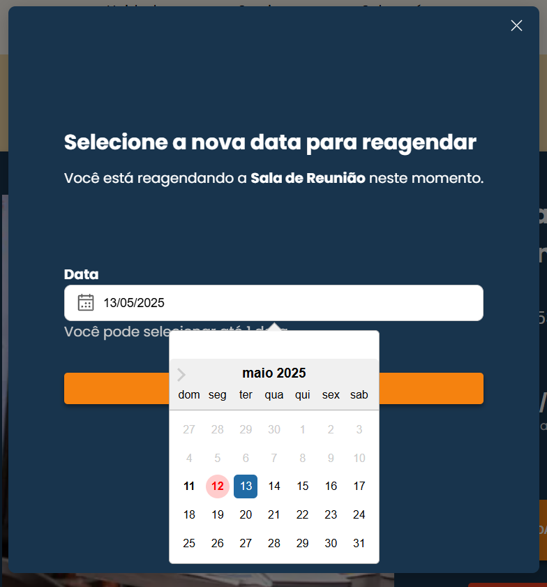

# Frontend Web

O frontend desta aplicação tem como objetivo proporcionar uma interface moderna, intuitiva e responsiva para os usuários do sistema de gestão de coworking. A aplicação permite que usuários consultem espaços disponíveis, realizem reservas e gerenciem suas atividades de forma prática e segura.

---

## Projeto da Interface Web

O projeto será dividido em 4 interfaces web:
- **Login e Register:** interface de login dos usuários, com possibilidade de cadastro no sistema.
- **Página Inicial:** homepage do sistema, composta por elementos institucionais e comerciais, organizados de maneira a garantir uma estrutura chamativa e moderna para os clientes e possíveis clientes.
- **Reserva:** permitir que os usuários autenticados possam reservar os espaços, podendo escolher as salas e os horários disponíveis para agendamento.
- **Gerenciamento de Reservas:** permitir que os usuários autenticados possam visualizar, reagendar ou cancelar suas reservas existentes. 

## Estrutura da Página de Login

- **Background:**  
  Imagem institucional de uma sala de reunião moderna e iluminada, proporcionando um visual harmônico e alinhado com o tema.

- **Formulário de Login:**
  - Logotipo da aplicação em destaque.
  - Mensagem de boas-vindas orientando o login.
  - Campo de entrada para usuário (e-mail).
  - Campo de entrada para senha.
  - Link para recuperação de senha.
  - Botão de ação "Login".
  - Link para cadastro de novos usuários.

---

## Estrutura da Página de Cadastro

- **Background:**  
  Imagem institucional de uma sala de reunião moderna e iluminada, proporcionando um visual harmônico e alinhado com o tema.

- **Formulário de Cadastro:**
  - Logotipo da aplicação em destaque.
  - Mensagem de boas-vindas incentivando o preenchimento do formulário.
  - Campo de entrada para Nome Completo.
  - Campo de entrada para Email (credencial de login).
  - Campo de entrada para Senha (campo do tipo password).
  - Botão de ação com destaque visual: Registrar.
  - Link inferior com texto: “Já é cliente? Faça login aqui”, redirecionando para a tela de login.

---

## Estrutura da Página Inicial (Homepage)

- **Header:**  
  Contém o logotipo, o menu de navegação com acesso às seções "Nosso Espaço", "Serviços", "Sobre nós", além dos botões de ação "Agende sua Visita" e "Entrar".

- **Banner Principal:**  
  Imagem de destaque de ambiente de coworking, acompanhada de uma chamada de ação promovendo a descoberta dos novos locais.

- **Serviços Prestados:**  
  Apresentação visual dos principais serviços (Sala de Reunião, Mesa Privativa) com ícones ilustrativos e descrições breves.

- **Diferenciais:**  
  Seção destacando atributos como "Studio Lab", "Sustentabilidade", "Fibra Óptica" e "Auditório Lab", cada um com ícones e texto resumido.

- **Sobre Nós:**  
  Texto descritivo sobre a missão e a visão da empresa, acompanhado de uma imagem ilustrativa do ambiente.

- **Nosso Espaço:**  
  Apresentação do espaço do coworking, utilizando imagens e descrições breves em formato de carrossel.

- **Footer:**  
  Contém informações de contato, endereços e um logotipo institucional.

---

## Estrutura da tela de Reservas

- **Header:**  
  Logotipo, menu de navegação principal, botão de ação "Agende sua Visita" e um ícone de perfil de usuário, que exibe um menu suspenso com opções como "Minhas Reservas", "Reservar" e "Sair".

- **Catálogo de Espaços Disponíveis:**
  - Os espaços disponíveis para reserva são exibidos em forma de cartões organizados em grade.
  - Cada cartão contém:
    - Imagem ilustrativa de cada sala.
    - Nome do espaço (ex: "Sala Privativa").
    - Identificação da unidade (ex: "Bloco 1 / Sala 3000").
    - Capacidade do espaço.
    - Campo para seleção da data da reserva.
    - Botão de ação **"Reservar"** para enviar a solicitação.
        
- **Footer:**  
  Contém informações de contato, endereços das unidades e um logotipo institucional.

---

## Estrutura da tela de Gerenciamento de Reservas

- **Header:**  
  Logotipo, menu de navegação principal, botão de ação "Agende sua Visita" e um ícone de perfil de usuário, que exibe um menu suspenso com opções como "Minhas Reservas", "Reservar" e "Sair".

- **Lista de Reservas:**
  - Cada reserva é exibida como um cartão.
  - Em cada cartão consta:
    - Imagem do espaço reservado.
    - Nome da sala de reunião.
    - Unidade de localização.
    - Horário agendado.
    - Três botões de ação:
      - **Reagendar**
      - **Cancelar Reserva**
        
- **Footer:**  
  Contém informações de contato, endereços das unidades e um logotipo institucional.

- **Pop-ups de reservas:**
  - Cartão de confirmação de cancelamento.
  - Modal para reagendamento.
    

---

### Wireframes

**Login Wireframe:**

- Logotipo no topo do formulário.
- Texto de boas-vindas e instruções resumidas.
- Campos para preenchimento de usuário e senha.
- Opção para recuperação de senha ("Esqueci minha senha").
- Botão principal de login destacado.
- Link para novos usuários realizarem o cadastro.

---

**Register Wireframe:**

- Logotipo no topo do formulário.
- Texto de boas-vindas com instrução direta para cadastro.
- Campos para preenchimento de:
    - Nome Completo
    - Email
    - Senha 
- Botão principal de registro.
- Link para usuários já cadastrados irem para a tela de login.

---

**Homepage Wireframe:**

- **Header:** Barra superior contendo navegação e botões de acesso.
- **Banner:** Área de destaque visual com imagem e chamada de ação.
- **Seções de Conteúdo:**
  - Cartões de serviços com imagens e descrições.
  - Diferenciais com ícones e texto explicativo.
  - Texto institucional "Sobre nós" e imagem ilustrativa.
  - Listagem dos espaços com imagens organizadas lado a lado.
- **Footer:** Rodapé com contatos e informações institucionais.

---

**Create Reservation Wireframe:**

---

**Manage Reservation Wireframe:**

- **Header:** Barra superior contendo navegação e botões de acesso. Com opções de login, reservas e gerenciamento de reservas.
- **Cartões de Reserva:** Imagem da sala + informações principais (nome da sala, unidade, data e hora).
- **Botões de ação:** Para reagendamento, ver lista de presença e cancelamento.
- **Footer:** Rodapé com contatos e informações institucionais.

---

### Design Visual

O design visual segue uma linha clean e corporativa, com o objetivo de transmitir confiabilidade e modernidade.

- **Paleta de Cores:**
  - Laranja claro (#F58220) - Destaques e botões.
  - Bege (#ECD3A2) - Background geral.
  - Azul escuro (#18344D) - Background de elementos.
  - Branco (#FFFFFF) - Plano de fundo.
  - Tons de cinza para textos secundários.

- **Tipografia:**
  - Principal: "Poppins" (Google Fonts).
  - Títulos: "Poppins Bold", textos normais: "Poppins Regular".

- **Ícones:**
  - Utilização de ícones minimalistas relacionados a coworking, comunicação e serviços.

- **Estilo de Layout:**
  - Estrutura em colunas verticais, com espaçamento generoso entre os elementos.
  - Botões grandes para facilitar a interação em dispositivos móveis.
  - Ícone de perfil com menu suspenso para facilitar a navegação entre funcionalidades.

---

## Fluxo de Dados

As imagens registradas abaixo neste documento, ilustram o fluxo completo de navegação do front end web Belo Space, contemplando as principais interações do usuário desde o cadastro até a gestão de reservas.

A primeira imagem representa o fluxo de acesso, com validações de cadastro e login, além do processo de recuperação de senha. Já a segunda imagem cobre a experiência após o login, incluindo agendamento de salas, visualização e cancelamento de reservas, acesso ao perfil e opção de logout.

Esses fluxos garantem uma navegação clara e intuitiva para o usuário, reforçando a usabilidade e eficiência da aplicação.

- **Legenda dos fluxos:**
  

- **Fluxo de login:**
  

- **Fluxo principal:**
  

---

## Tecnologias Utilizadas

- **Linguagem Principal:** JavaScript (ES6+)
- **Framework:** React.js
- **Design:** Figma

---

## Considerações de Segurança

A segurança da aplicação front-end visa proteger os dados do usuário, garantir a integridade da autenticação e evitar vulnerabilidades comuns em aplicações web.

### Autenticação com JWT

A autenticação é realizada por meio de tokens JWT gerados pelo backend no login. O token é armazenado em memória (evitando localStorage) e enviado nas requisições via header:

`Authorization: Bearer <token>`

O token possui tempo de expiração e é utilizado para acesso a rotas protegidas da aplicação.

### Controle de Acesso

A interface controla a visibilidade de elementos com base no perfil do usuário autenticado (admin ou customer). Rotas sensíveis redirecionam para login caso não haja autenticação válida.

### Validação de Dados

Formulários realizam validação local dos campos obrigatórios, formatos e regras de negócio, reduzindo falhas de envio e protegendo a aplicação contra dados inconsistentes.

### Prevenção de Vulnerabilidades

A aplicação evita inserção direta de conteúdo HTML no DOM e não utiliza `dangerouslySetInnerHTML`, prevenindo XSS. A autenticação via token mitiga riscos de CSRF.

### Comunicação Segura

Todas as requisições são feitas sobre HTTPS, assegurando criptografia dos dados trocados entre o front-end e a API.
  
## Testes

[Frontend Testes](/docs/frontend-web-tests.md)   

# Referências

- Microfundamento: APIs e Web Services
- Microfundamento: Arquitetura de Software Distribuído
- Microfundamento: Desenvolvimento de Aplicações Móveis
- NextJS Docs
- React Docs
